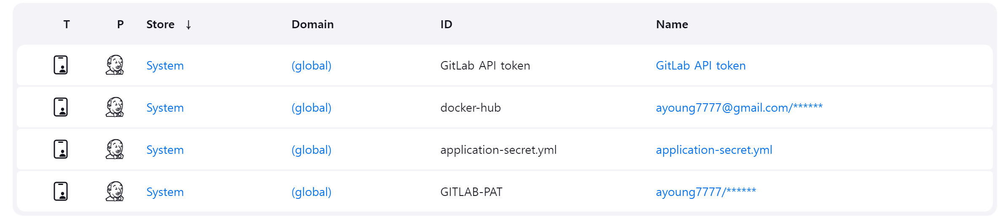

# 포팅 매뉴얼

# 1. 개발 버전

| **분류**                  | **환경**         | **버전**            |
| ------------------------- | ---------------- | ------------------- |
| **Backend (Spring Boot)** | JDK              | `openjdk - 17.0.12` |
|                           | Spring Boot      | `3.3.3`             |
|                           | JPA              | `3.3.3`             |
|                           | Spring Security  | `3.3.3`             |
|                           | OAuth2           | `3.3.3`             |
|                           | Redis            | `3.3.3`             |
|                           | QueryDSL         | `5.0.0`             |
|                           | Gradle           | `8.8`               |
|                           | Lombok           | `1.18.34`           |
|                           | Swagger          | `2.2.22`            |
|                           | jjwt             | `0.11.2`            |
|                           | Junit            | `5.10.3`            |
|                           | spring-cloud-aws | `2.2.6`             |
| **Electron**              | React            | `18.3.1`            |
|                           | Vite             | `4.3.3`             |
|                           | TailwindCSS      | `3.4.11`            |
|                           | zustand          | `5.0.1`             |
|                           | chart.js         | `4.4.6`             |
|                           | three.js         | `0.170.0`           |
|                           | Electron         | `33.0.2`            |
|                           | electron-store   | `10.0.0`            |
| **Extension**             | TailwindCSS      | `3.4.11`            |
| **Database**              | PostgreSql       | `15`                |
|                           | Redis            | `7.4`               |
| **Infra**                 | Docker           | `27.2.1`            |
|                           | Jenkins          | `latest`            |
|                           | Nginx            | `1.15-alpine`       |
|                           | Ubuntu           | `20.04.6`           |
| **IDE**                   | IntelliJ         | `2023.3.6`          |
|                           | VSCode           | `1.93.1`            |
|                           | pgAdmin          | `4`                 |

# 2. 인프라

- 포트 사용

1. ufw 상태 확인  
   `$ sudo ufw status numbered`

2. 사용할 포트 허용하기  
   `$ sudo ufw allow 22`

| **서버**      | **애플리케이션** | **포트** |
| ------------- | ---------------- | -------- |
| **main**      | Nginx: HTTP      | `80`     |
|               | Nginx: HTTPS     | `443`    |
|               | PostgreSql       | `5432`   |
|               | Redis            | `6379`   |
|               | Backend          | `8080`   |
|               | Jenkins          | `9090`   |
|               | websocket        | `12345`  |
| **extension** | websocket        | `12345`  |

### Docker-Compose

- docker-compose.yml

  - PostgreSql
  - redis
  - jenkins

  ```
  name: peaktime
  services:
    postgres:
      container_name: postgres
      image: postgres:15
      restart: always
      volumes:
        - /volumes/postgres-data:/var/lib/postgresql/data
      ports:
        - "5432:5432"
      environment:
        POSTGRES_USER: [루트 사용자명]
        POSTGRES_PASSWORD: [루트 비밀번호]
        POSTGRES_DB: peaktime
      networks:
        - [네트워크명]

    redis:
      container_name: redis
      image: redis
      ports:
        - "6379:6379"
      volumes:
        - /volumes/redis/redis-data:/data
        - /volumes/redis/redis.conf:/usr/local/etc/redis/redis.conf
      command: redis-server /usr/local/etc/redis/redis.conf
      networks:
        - [네트워크명]

    jenkins:
      image: jenkins/jenkins:lts
      container_name: jenkins
      volumes:
        - /var/run/docker.sock:/var/run/docker.sock
        - /volumes/jenkins:/var/jenkins_home
      ports:
        - "9090:8080"
      privileged: true
      user: root
      networks:
        - [네트워크명]

  networks:
    [네트워크명]:
      name: [네트워크명]
      driver: bridge
  ```

- docker-compose-nginx.yml

  - nginx
  - certbot

  ```
  name: peaktime-nginx
  services:
    nginx:
      container_name: nginx
      image: nginx:1.15-alpine
      restart: unless-stopped
      volumes:
        - ./volumes/nginx:/etc/nginx/conf.d
        - ./volumes/certbot/conf:/etc/letsencrypt
        - ./volumes/certbot/www:/var/www/certbot
        - ./front:/front
      ports:
        - "80:80"
        - "443:443"
      networks:
        - [네트워크명]
      command: "/bin/sh -c 'while :; do sleep 6h & wait $${!}; nginx -s reload; done & nginx -g \"daemon off;\"'"

    certbot:
      container_name: certbot
      image: certbot/certbot:latest
      restart: unless-stopped
      volumes:
        - ./volumes/certbot/conf:/etc/letsencrypt
        - ./volumes/certbot/www:/var/www/certbot
      networks:
        - [네트워크명]
      entrypoint: "/bin/sh -c 'trap exit TERM; while :; do certbot renew; sleep 12h & wait $${!}; done;'"

  networks:
    [네트워크명]:
      driver: bridge

  ```

### jenkins

- 백엔드 파이프라인

  ```pipeline {
      environment {
          dockerhub_repository = "[도커 허브 레포지토리명]"
          dockerImage = ''
          endpoint = "[Mattermost 연동 엔드포인트 주소]"
          channel = "[Mattermost 연동 채널 아이디]"
      }

      agent any

      stages {

          stage('START NOTIFICATION') {
              steps {
                  script {
                      mattermostSend(
                          color: 'info',
                          message: "빌드 시작: ${env.JOB_NAME} #${env.BUILD_NUMBER} (<${env.BUILD_URL}|Details>)",
                          endpoint: "${endpoint}",
                          channel: "${channel}"
                      )
                      echo "TARGET_BRANCH : ${env.TARGET_BRANCH}"
                      echo "STATE : ${env.STATE}"
                  }
              }
          }

          stage('GIT CLONE') {
              steps {
                  git branch: "[브랜치명]", credentialsId: "[GitLab 크리덴셜]", url: "[GitLab 주소]"
              }
          }

          stage('ADD YML FILE') {
              steps {
                  withCredentials([file(credentialsId: 'application-secret.yml', variable: 'configFile')]) {
                      script {
                          sh 'cp $configFile BE/peaktime/src/main/resources/application-secret.yml'
                      }
                  }
              }
          }

          stage('BUILD') {
              steps {
                  dir('BE/peaktime') {
                      sh "chmod +x gradlew"
                      sh "./gradlew clean bootJar"
                  }
              }
          }

          stage("DOCKER IMAGE BUILD") {
              steps {
                  dir('BE/peaktime') {
                      script {
                          dockerImage = docker.build("${dockerhub_repository}:${BUILD_NUMBER}")
                      }
                  }
              }
          }

          stage("DOCKER IMAGE PUSH") {
              steps {
                  script {
                      docker.withRegistry('', 'docker-hub') {
                          dockerImage.push("${BUILD_NUMBER}")
                      }
                  }
              }
          }

          stage("DEPLOY") {
              steps {
                  script {
                      sh """
                        docker rm -f springboot || true
                        docker run -e TZ=Asia/Seoul --name springboot -d -p 8080:8080 --net=[네트워크명] [도커허브 레퍼지토리명]:${BUILD_NUMBER}
                      """
                  }
              }
          }
      }

      post {
          success {
              script {
                  def Author_ID = sh(script: "git show -s --pretty=%an", returnStdout: true).trim()
                  def Author_Name = sh(script: "git show -s --pretty=%ae", returnStdout: true).trim()
                  mattermostSend(
                      color: 'good',
                      message: "빌드 성공: ${env.JOB_NAME} #${env.BUILD_NUMBER} by ${Author_ID}(${Author_Name}) (<${env.BUILD_URL}|Details>)",
                      endpoint: "${endpoint}",
                      channel: "${channel}"
                  )
              }
          }
          failure {
              script {
                  def Author_ID = sh(script: "git show -s --pretty=%an", returnStdout: true).trim()
                  def Author_Name = sh(script: "git show -s --pretty=%ae", returnStdout: true).trim()
                  mattermostSend(
                      color: 'danger',
                      message: "빌드 실패: ${env.JOB_NAME} #${env.BUILD_NUMBER} by ${Author_ID}(${Author_Name}) (<${env.BUILD_URL}|Details>)",
                      endpoint: "${endpoint}",
                      channel: "${channel}"
                  )
              }
          }
      }
  }
  ```

- 플러그인

  - git
  - git client
  - Generic Webhook Trigger
  - GitLab
  - GitLab API
  - blueocean
  - docker pipiline

- Jenkins 관리

  - Credentials
    

- DockerFile

  - backend Dockerfile

    ```FROM openjdk:17-jdk

    ARG JAR_FILE=./build/libs/*.jar

    COPY ${JAR_FILE} app.jar

    ENTRYPOINT ["java", "-jar", "/app.jar"]

    EXPOSE 8080
    ```

## Server

- Redis
  - redis.conf
  ```bind 0.0.0.0
    port [포트 번호]
    appendonly yes
    appendfilename "appendonly.aof"
    requirepass [비밀번호]
  ```
- nginx

  - app.conf

  ```server {
            listen 80;
            listen [::]:80;
            server_name [도메인 주소];
            server_tokens off;

            location /.well-known/acme-challenge/ {
                    root /var/www/certbot;
            }

            location / {
                    return 301 https://$host$request_uri;
            }
    }

    server {
            listen 443 ssl;
            listen [::]:443 ssl;
            server_name [도메인 주소];

            ssl_certificate /etc/letsencrypt/live/[도메인 주소]/fullchain.pem;
            ssl_certificate_key /etc/letsencrypt/live/[도메인 주소]/privkey.pem;
            include /etc/letsencrypt/options-ssl-nginx.conf;
            ssl_dhparam /etc/letsencrypt/ssl-dhparams.pem;

            location / {
                root  /front;
                index index.html;
            }

            location /api/ {
                    proxy_pass  [도메인 주소]:[포트번호];
                    proxy_set_header Connection '';
                    proxy_http_version 1.1;

                    proxy_set_header    Host                $http_host;
                    proxy_set_header    X-Real-IP           $remote_addr;
                    proxy_set_header    X-Forwarded-For     $proxy_add_x_forwarded_for;
                    proxy_read_timeout 3600s;

            }
            location /api/v1/schedules {
                    proxy_pass [도메인 주소]:[포트번호];
                    proxy_buffering off;
                    proxy_set_header Connection '';
                    chunked_transfer_encoding on;
                    add_header Cache-Control 'no-cache';
                    proxy_read_timeout 3600;
                    proxy_send_timeout 3600;
            }
  ```

- nginx 및 certbot 실행

  - init-letsencrypt.sh

  ```#!/bin/bash

  # 도커 컴포즈 설치 여부
  if ! [ -x "$(command -v docker-compose)" ]; then
    echo 'Error: docker-compose is not installed.' >&2
    exit 1
  fi

  domains=([도메인 주소])
  rsa_key_size=4096
  data_path="./volumes/certbot"
  email="[이메일]"
  cert_name="[도메인 주소]"
  staging=1

  if [ -d "$data_path" ]; then
    read -p "Existing data found for $domains. Continue and replace existing certificate? (y/N) " decision
    if [ "$decision" != "Y" ] && [ "$decision" != "y" ]; then
      exit
    fi
  fi

  if [ ! -e "$data_path/conf/options-ssl-nginx.conf" ] || [ ! -e "$data_path/conf/ssl-dhparams.pem" ]; then
    echo "### Downloading recommended TLS parameters ..."
    mkdir -p "$data_path/conf"
    curl -s https://raw.githubusercontent.com/certbot/certbot/master/certbot-nginx/certbot_nginx/_internal/tls_configs/options-ssl-nginx.conf > "$data_path/conf/options-ssl-nginx.conf"
    curl -s https://raw.githubusercontent.com/certbot/certbot/master/certbot/certbot/ssl-dhparams.pem > "$data_path/conf/ssl-dhparams.pem"
    echo
  fi

  echo "### Creating dummy certificate for $domains ..."
  path="/etc/letsencrypt/live/$domains"
  mkdir -p "$data_path/conf/live/$domains"
  docker-compose -f docker-compose-nginx.yml run --rm --entrypoint "\
    openssl req -x509 -nodes -newkey rsa:$rsa_key_size -days 1\
      -keyout '$path/privkey.pem' \
      -out '$path/fullchain.pem' \
      -subj '/CN=localhost'" certbot
  echo

  echo "### Starting nginx ..."
  docker-compose -f docker-compose-nginx.yml up --force-recreate -d nginx
  echo

  echo "### Deleting dummy certificate for $domains ..."
  docker-compose -f docker-compose-nginx.yml run --rm --entrypoint "\
    rm -Rf /etc/letsencrypt/live/$domains && \
    rm -Rf /etc/letsencrypt/archive/$domains && \
    rm -Rf /etc/letsencrypt/renewal/$domains.conf" certbot
  echo

  echo "### Requesting Let's Encrypt certificate for $domains ..."
  # Join $domains to -d args
  domain_args=""
  for domain in "${domains[@]}"; do
    domain_args="$domain_args -d $domain"
  done

  # Select appropriate email arg
  case "$email" in
    "") email_arg="--register-unsafely-without-email" ;;
    *) email_arg="--email $email" ;;
  esac

  # Enable staging mode if needed
  if [ $staging != "0" ]; then staging_arg="--staging"; fi

  docker-compose -f docker-compose-nginx.yml run --rm --entrypoint "\
    certbot certonly --webroot -w /var/www/certbot \
      $staging_arg \
      $email_arg \
      $domain_args \
      --cert-name=$cert_name \
      --rsa-key-size $rsa_key_size \
      --agree-tos \
      --force-renewal -v" certbot
  echo

  echo "### Reloading nginx ..."
  docker-compose -f docker-compose-nginx.yml exec nginx nginx -s reload
  ```

## Backend

### application.yml

```java
spring:
  application:
    name: [애플리케이션 명]

  datasource:
    hikari:
      connection-timeout: 30000
      maximum-pool-size: 10
      minimum-idle: 5
      idle-timeout: 600000
      max-lifetime: 1800000

  profiles:
    include: secret

server:
  port: [포트 번호]
  servlet:
    context-path: /api/v1

springdoc:
  swagger-ui:
    path: /swagger-ui/index.html
  api-docs:
    path: /v3/api-docs
```

### application-secret.yml

```java
spring:
  datasource:
    driver-class-name: org.postgresql.Driver
    url: jdbc:postgresql://[도메인명]:[포트명]/[DB명]
    username: [DB 유저명]
    password: [DB 비밀번호]
    hikari:
      maximum-pool-size: 4
  jpa:
    hibernate:
      ddl-auto: update
    show-sql: true
    database: postgresql
    database-platform: org.hibernate.dialect.PostgreSQLDialect
    open-in-view: false
    generate-ddl: true
    properties:
      hibernate:
        batch_size: 20
        format_sql: true
  data:
    redis:
      host: [도메인 명]
      port: [포트 번호]
      password: [레디스 비밀번호]
      timeout: 5000
      lettuce:
        pool:
          max-active: 10
          max-idle: 5
          min-idle: 2
          max-wait: 1000
  jackson:
    time-zone: Asia/Seoul
  mail:
    tx: [메일명]
    password: [메일 애플리케이션 시크릿키]
openai:
  api:
    model: gpt-3.5-turbo
    key: [openAI 시크릿 키]
    url: https://api.openai.com/v1/chat/completions
jwt:
  token:
    access-expire-time: 7200
    refresh-expire-time: 1209600
    secret-key: [JWT 시크릿 키]
```

## Frontend

### .env

```
  VITE_BACK_URL='[백엔드 URL]'
  BACK_URL='[백엔드 URL]'
```

# 3. 디렉토리 구조

### Backend

```
├── README.md
└── BE/peaktime
    ├── Dockerfile
    ├── build
    ├── build.gradle
    ├── gradle
    ├── gradlew
    ├── gradlew.bat
    ├── settings.gradle
    └── src
```

### Electron

```
├── README.md
└── PeakTime
  ├── README.md
  ├── index.html
  ├── node_modules
  ├── package-lock.json
  ├── package.json
  ├── postcss.config.js
  ├── public
  ├── src
  ├── electron
  ├── tailwind.config.cjs
  └── vite.config.ts
```

### Extension

```
├── README.md
└── PeakTime
  ├── css
  ├── font
  ├── html
  ├── icons
  ├── image
  ├── js
  └── manifest.json
```
